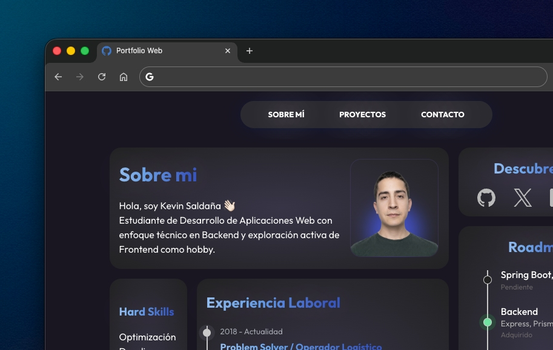

<h1 align="center" valign="middle">💻 Porfolio Personal - HTML | CSS</h1>

<a href="https://porfolio-es.vercel.app/">
    
</a>
Este repositorio contiene mi portfolio personal, un proyecto donde he decidido priorizar los estándares web por encima de las tendencias de frameworks.

## Filosofía del Proyecto: "Vanilla-First"

En pleno **2026** y un ecosistema saturado de frameworks y librerías pesadas, este proyecto nace con la intención de demostrar que el dominio de los fundamentos es lo que realmente permite hacer un desarrollo web eficiente.

**¿Por qué solo HTML y CSS?**
- **Robustez:** Un código que cumple los estándares de la W3C es un código que no caduca.
- **Rendimiento Nativo:** Sin tiempos de compilación ni dependencias innecesarias. Carga instantánea.
- **Interactividad Declarativa:** Gracias al avance de los estándares web, hoy es posible crear animaciones ligadas al scroll o gestionar el Modo Oscuro de forma nativa, eliminando la necesidad de JavaScript para lógica visual.

---

## 🛠️ Puntos destacados de mi Código

### 1. Arquitectura de Diseño - Bento Grid
He utilizado CSS Grid de forma avanzada para crear un layout tipo Bento grid. En lugar de depender de frameworks como Tailwind o Bootstrap para la estructura, he definido un sistema de áreas que se reorganiza de forma fluida mediante Media Queries.

### 2. Gestión de Temas - Dark Mode nativo
He implementado el modo oscuro aprovechando las capacidades modernas de CSS como la pseudo-clase `:has()` y las Custom Properties (Variables CSS). Esto permite cambiar toda la paleta de colores del sitio con una sola casilla de verificación sin escribir una sola línea de lógica compleja en JavaScript

```css
body:has(#dark-mode-palanca:checked) {
    --bg-color: #ffffff;
    --text-color: #000000;
    /* ... */
}
```

### 3. Animaciones de Interfaz - CSS Only
He integrado animaciones de entrada y estados dinámicos utilizando @keyframes y view-timeline. Esto dota a la web de una experiencia de usuario moderna y "viva" sin el impacto en el rendimiento que suponen las librerías de animación externas.

```css
button::before {
    view-timeline-name: --reveal;
    animation-name: show;
    animation-fill-mode: both;
    animation-timeline: --reveal;
    animation-range: entry 50% cover 18%;
}
```

He implementado un entorno tridimensional para los elementos interactivos. Mediante el uso de transform-style: preserve-3d, los botones y tarjetas no son elementos planos, sino objetos con volumen en el eje Z. Esto permite crear efectos de iluminación y profundidad realistas.

```css
.cards, .button {
    z-index: 1;
    transform-style: preserve-3d;
    position: relative;
    /* ... */
}
```

### 4. Semántica y Accesibilidad
La estructura HTML es 100% semántica, utilizando etiquetas como `<main>, <article>, <section> y <nav>`, lo que garantiza una base sólida tanto para el SEO como para lectores de pantalla.

